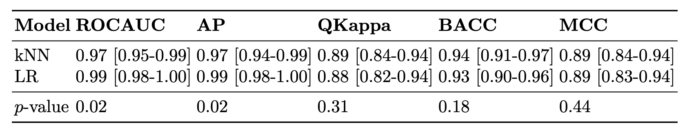

# StaMBO: Statistical model comparison with bootstrap 

This package is aimed to be a one-stop-shop for statistical testing in machine learning when it comes to evaluating models on a test set. Currently, we do not support multi-label classification, and computing a significane of ranking multiple methods. Below you can find examples on how to do model comparison in classification, regresson, and semantic segmentation.

## In practice
Install from PyPI:
```
pip install stambo
```

The use of the library is then straightforward:
```
import stambo
...
seed = 42
testing_result = stambo.compare_models(y_test, preds_1, preds_2, metrics=("ROCAUC", "AP", "QKappa", "BACC", "MCC"), seed=seed)
print(stambo.to_latex(testing_result))
```

The above will print a LaTeX table, which one can easily copypaste. As an example, below is the rendered table, which was returned in `notebooks/Classification_example`:


Fore more advanced documentation see the documentation. By default, binary, multi-class and multi-label classification, as well as regression are supported.

One can also use the library to perform a simple two-sample test. For example, to compare the means of two distributions:
```
import stambo
...
seed = 42
res = stambo.two_sample_test(sample_1, sample_2, statistics={"Mean": lambda x: x.mean()})
```


## Contributing

To setup a dev environment, you should use the provided environemnt file, and compile the documentation locally:
```
conda env create -f env.yaml
conda activate stambo-dev
pip install -e .
cd docs
make html
```

## Author
Aleksei Tiulpin
